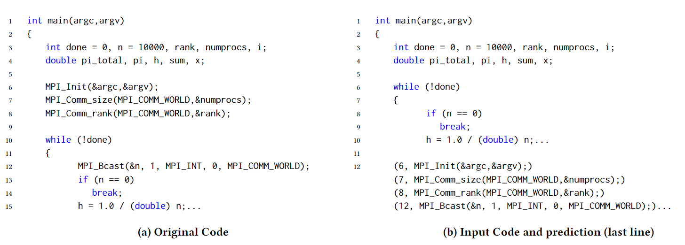

# MPI Code Generation through Domain-Specific Language Models
The imperative need to scale computation across numerous
nodes accentuates the significance of efficient parallel com-
puting, particularly in the realm of Message Passing Inter-
face (MPI) integration. While MPI serves as a cornerstone for
large-scale parallelism, its seamless integration into codebases,
especially concerning domain decomposition, has proven chal-
lenging. Static tools aimed at addressing this hurdle have exhib-
ited limited effectiveness and scalability. Surprisingly, contem-
porary language models designed for code-related problem-
solving have demonstrated utility in parallel programming
tasks such as OpenMP shared memory pragma generation.
However, the nuanced task of generating intricate, multi-functional
MPI codes across diverse locations has remained unexplored.
This study first investigates the performance of state-of-
the-art language models in generating MPI codes using varied
context sizes for next-token predictions, employing the HP-
CorpusMPI dataset (based on MPICodeCorpus and HPCor-
pus). Findings reveal that widely used models like GPT-3.5 and
specialized multi-lingual code models like PolyCoder exhibit
notable performance degradation when generating MPI codes
compared to their outcomes for general-purpose codes. In con-
trast, domain-specific models like MonoCoder, pre-trained
for the C and C++ languages associated with MPI, outper-
form larger models, showcasing high generality capabilities,
especially when local misleading semantics are mitigated.
Subsequently, we introduce a dedicated downstream task,
fine-tuning MonoCoder on HPCorpusMPI, resulting in the
creation of MPIrigen. We propose an innovative pre-process
for completion only after observing the whole code, thus en-
abling better completion with a wider context. Comparative
analysis against PolyCoder fine-tuning and GPT zero-shot
performance, using a novel HPC-oriented evaluation method,
demonstrates that MPIrigen excels in generating accurate MPI
functions up to 0.8 accuracy in location and function predic-
tions, and with more than 0.9 accuracy for argument predic-
tions. The success of this tailored solution underscores the
importance of domain-specific fine-tuning in optimizing lan-
guage models for parallel computing code generation, paving
the way for a new generation of automatic parallelization tools.
          
## Desired Objective  ##

The MPI functions in the source code are removed and concatenated with their corresponding line number to the last line. This way, MPI-rigen learns in a left-to-right fashion the relation between code and its appropriate MPI functions. Finally it gets MPI codes with functions removed and predict the locations and functions themselves.

# Instructions
## Requirments
First, clone the MPI-rigen code and datasets provided here.
```
clone https://github.com/Scientific-Computing-Lab-NRCN/MPI-rigen.git
```
Then, create the proper conda environment out of the requirements.
```
conda create --name <env_name> --file requirements.txt
```
Then, activate your environment:
```
conda activate <env_name>
```


## Citation
For more information about the measures and their means of the implementations, please refer to the paper.
If you found these codes useful for your research, please consider citing: [https://arxiv.org/abs/2305.09438](https://arxiv.org/abs/2402.09126)


## Running
### MonoCoder Scripts
The `MonoCoder` directory contains two self-contained scripts to fine-tune or evaluate correspondingly:

1. **`train.sh`**: This script includes the configuration for fine-tuning the model and create MPI-rigen.

2. **`test.sh`**: Use this script to regenerate results on the test split. It provides code for running the model on the test data.

## Usage

### Hugging Face Model
Monocoder is uploaded to Hugging Face and can be easily utilized in your own projects. Here's an example of how to use it in Python:

```python
from transformers import GPTNeoXForCausalLM, GPT2Tokenizer

tokenizer = GPT2Tokenizer(vocab_file=args.vocab_file, merges_file=args.merge_file, model_input_names=['input_ids'])
model = GPTNeoXForCausalLM.from_pretrained('MonoCoder')
```

